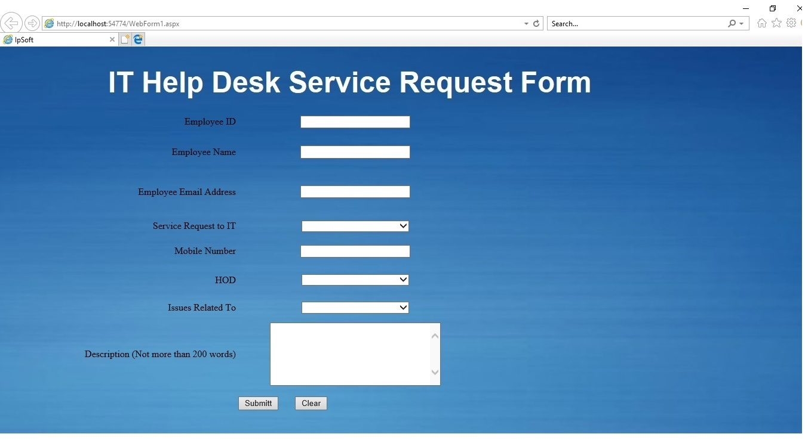
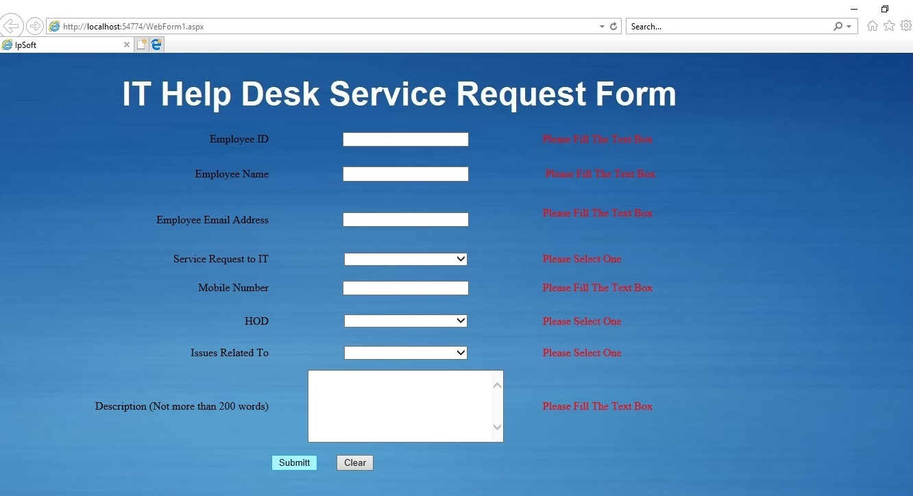
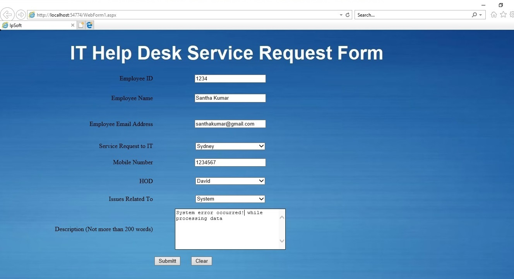
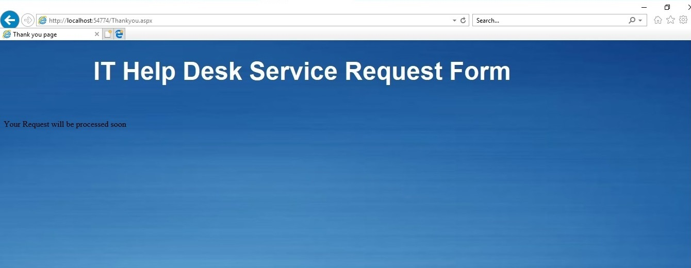
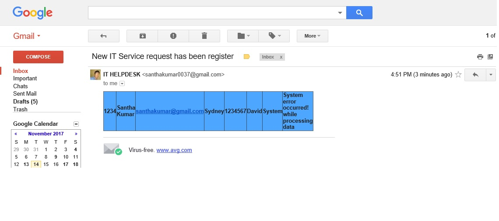
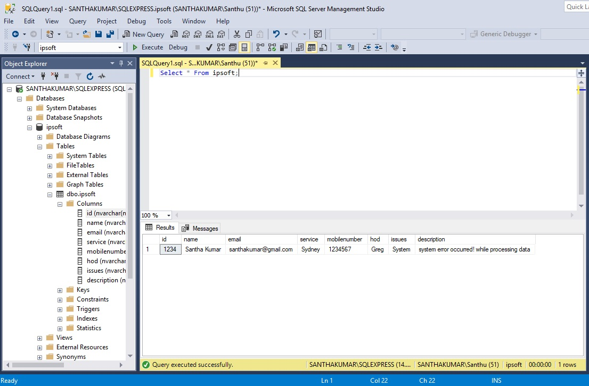

# IT-HelpDesk
**Purpose of this project:**
Ipsoft is an online service request webpage developed using Asp .Net and C#, which can be used to send IT services or issues related request across different region to different HOD (Head of Department) or Manager within an organisation.    
  
**Basic Work Flow**
1. Open WebForm1.aspx  
2. Home page looks like the bellow screenshot  

3. Validation check 

4. Thank you page

5. Received Gmail request related to the service request 

6. Data stored in MS SQL

